# [📈 Live Status](https://divtiply.github.io/artupptime): <!--live status--> **🟧 Partial outage**

This repository contains the open-source uptime monitor and status page for [Michel Ace](https://divtiply.github.io/artupptime), powered by [Upptime](https://github.com/upptime/upptime).

With [Upptime](https://upptime.js.org), you can get your own unlimited and free uptime monitor and status page, powered entirely by a GitHub repository. We use [Issues](https://github.com/divtiply/artupptime/issues) as incident reports, [Actions](https://github.com/divtiply/artupptime/actions) as uptime monitors, and [Pages](https://divtiply.github.io/artupptime) for the status page.

<!--start: status pages-->
<!-- This summary is generated by Upptime (https://github.com/upptime/upptime) -->
<!-- Do not edit this manually, your changes will be overwritten -->
<!-- prettier-ignore -->
| URL | Status | History | Response Time | Uptime |
| --- | ------ | ------- | ------------- | ------ |
|  [Christie's](https://www.christies.com/) | 🟩 Up | [christies.yml](https://github.com/divtiply/artupptime/commits/HEAD/history/christies.yml) | 

 281ms
     
 | 

<a href="https://divtiply.github.io/artupptime/history/christies">100.00%</a>
    

|  [Sotheby's](https://www.sothebys.com/en/) | 🟩 Up | [sothebys.yml](https://github.com/divtiply/artupptime/commits/HEAD/history/sothebys.yml) | 

 136ms
     
 | 

<a href="https://divtiply.github.io/artupptime/history/sothebys">100.00%</a>
    

|  [Phillips](https://www.phillips.com/) | 🟩 Up | [phillips.yml](https://github.com/divtiply/artupptime/commits/HEAD/history/phillips.yml) | 

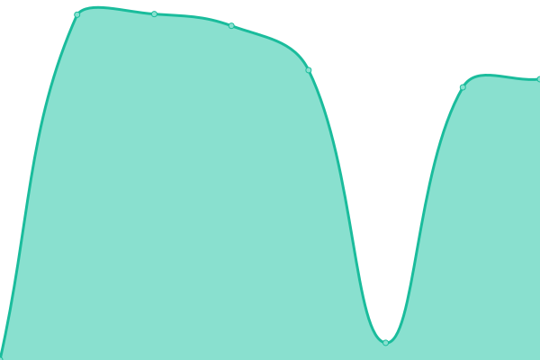 866ms
     
 | 

<a href="https://divtiply.github.io/artupptime/history/phillips">100.00%</a>
    

|  [Bonhams](https://www.bonhams.com/) | 🟥 Down | [bonhams.yml](https://github.com/divtiply/artupptime/commits/HEAD/history/bonhams.yml) | 

 104ms
     
 | 

<a href="https://divtiply.github.io/artupptime/history/bonhams">0.00%</a>
    

|  [Bonhams Cornette de Saint Cyr](https://csc.bonhams.com/en/) | 🟥 Down | [cornette-de-saint-cyr.yml](https://github.com/divtiply/artupptime/commits/HEAD/history/cornette-de-saint-cyr.yml) | 

 86ms
     
 | 

<a href="https://divtiply.github.io/artupptime/history/cornette-de-saint-cyr">0.00%</a>
    

|  [Bonhams Skinner](https://skinner.bonhams.com/) | 🟥 Down | [skinner.yml](https://github.com/divtiply/artupptime/commits/HEAD/history/skinner.yml) | 

 95ms
     
 | 

<a href="https://divtiply.github.io/artupptime/history/skinner">0.00%</a>
    

|  [Bukowskis - Bonhams Network](https://www.bukowskis.com/en) | 🟩 Up | [bukowskis.yml](https://github.com/divtiply/artupptime/commits/HEAD/history/bukowskis.yml) | 

 1306ms
     
 | 

<a href="https://divtiply.github.io/artupptime/history/bukowskis">100.00%</a>
    

|  [Bruun Rasmussen - Bonhams Network](https://bruun-rasmussen.dk/m) | 🟥 Down | [bruun-rasmussen.yml](https://github.com/divtiply/artupptime/commits/HEAD/history/bruun-rasmussen.yml) | 

 631ms
     
 | 

<a href="https://divtiply.github.io/artupptime/history/bruun-rasmussen">0.00%</a>
    

|  [Heritage Auctions](https://www.ha.com/) | 🟥 Down | [heritage-auctions.yml](https://github.com/divtiply/artupptime/commits/HEAD/history/heritage-auctions.yml) | 

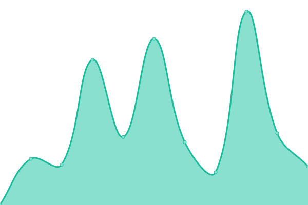 262ms
     
 | 

<a href="https://divtiply.github.io/artupptime/history/heritage-auctions">0.28%</a>
    

|  [Artcurial](https://www.artcurial.com/en) | 🟩 Up | [artcurial.yml](https://github.com/divtiply/artupptime/commits/HEAD/history/artcurial.yml) | 

 743ms
     
 | 

<a href="https://divtiply.github.io/artupptime/history/artcurial">100.00%</a>
    

|  [Ketterer Kunst](https://www.kettererkunst.com/) | 🟩 Up | [keterrerkunst.yml](https://github.com/divtiply/artupptime/commits/HEAD/history/keterrerkunst.yml) | 

 991ms
     
 | 

<a href="https://divtiply.github.io/artupptime/history/keterrerkunst">100.00%</a>
    

|  [Grisebach](https://www.grisebach.com/en/) | 🟩 Up | [grisebach.yml](https://github.com/divtiply/artupptime/commits/HEAD/history/grisebach.yml) | 

 1284ms
     
 | 

<a href="https://divtiply.github.io/artupptime/history/grisebach">100.00%</a>
    

|  [Seoul Auction](https://www.seoulauction.com/?lang=en) | 🟩 Up | [seoul-auction.yml](https://github.com/divtiply/artupptime/commits/HEAD/history/seoul-auction.yml) | 

 1341ms
     
 | 

<a href="https://divtiply.github.io/artupptime/history/seoul-auction">100.00%</a>
    

|  [Mainichi Auction](https://www.my-auction.co.jp/en/) | 🟩 Up | [mainichi-auction.yml](https://github.com/divtiply/artupptime/commits/HEAD/history/mainichi-auction.yml) | 

 1004ms
     
 | 

<a href="https://divtiply.github.io/artupptime/history/mainichi-auction">100.00%</a>
    

|  [Dorotheum](https://www.dorotheum.com/en/) | 🟩 Up | [dorotheum.yml](https://github.com/divtiply/artupptime/commits/HEAD/history/dorotheum.yml) | 

 1156ms
     
 | 

<a href="https://divtiply.github.io/artupptime/history/dorotheum">100.00%</a>
    

|  [Heffel](https://www.heffel.com/) | 🟩 Up | [heffel.yml](https://github.com/divtiply/artupptime/commits/HEAD/history/heffel.yml) | 

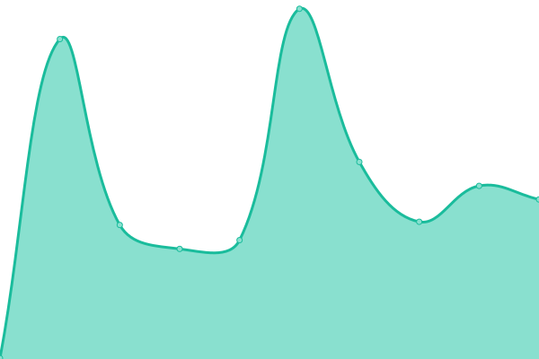 279ms
     
 | 

<a href="https://divtiply.github.io/artupptime/history/heffel">100.00%</a>
    

|  [Swann Galleries](https://www.swanngalleries.com/) | 🟩 Up | [swan-galleries.yml](https://github.com/divtiply/artupptime/commits/HEAD/history/swan-galleries.yml) | 

 1432ms
     
 | 

<a href="https://divtiply.github.io/artupptime/history/swan-galleries">100.00%</a>
    

|  [Lempertz](https://www.lempertz.com/en/) | 🟩 Up | [lempertz.yml](https://github.com/divtiply/artupptime/commits/HEAD/history/lempertz.yml) | 

 916ms
     
 | 

<a href="https://divtiply.github.io/artupptime/history/lempertz">100.00%</a>
    

|  [Ansorena](https://www.ansorena.com/en) | 🟩 Up | [ansorena.yml](https://github.com/divtiply/artupptime/commits/HEAD/history/ansorena.yml) | 

 1237ms
     
 | 

<a href="https://divtiply.github.io/artupptime/history/ansorena">100.00%</a>
    

|  [Rago - Rago Wright Network](https://www.ragoarts.com/) | 🟩 Up | [rago.yml](https://github.com/divtiply/artupptime/commits/HEAD/history/rago.yml) | 

 1652ms
     
 | 

<a href="https://divtiply.github.io/artupptime/history/rago">99.59%</a>
    

|  [Wright - Rago Wright Network](https://www.wright20.com/) | 🟩 Up | [wright.yml](https://github.com/divtiply/artupptime/commits/HEAD/history/wright.yml) | 

 1747ms
     
 | 

<a href="https://divtiply.github.io/artupptime/history/wright">99.62%</a>
    

|  [LAMA - Rago Wright Network](https://www.lamodern.com/) | 🟩 Up | [lama.yml](https://github.com/divtiply/artupptime/commits/HEAD/history/lama.yml) | 

 1419ms
     
 | 

<a href="https://divtiply.github.io/artupptime/history/lama">99.80%</a>
    

|  [Toomey & Co - Rago Wright Network](https://www.toomeyco.com/) | 🟩 Up | [toomey-and-co.yml](https://github.com/divtiply/artupptime/commits/HEAD/history/toomey-and-co.yml) | 

 2253ms
     
 | 

<a href="https://divtiply.github.io/artupptime/history/toomey-and-co">99.82%</a>
    

|  [Desa Unicum](https://desa.pl/en/) | 🟩 Up | [desa-unicum.yml](https://github.com/divtiply/artupptime/commits/HEAD/history/desa-unicum.yml) | 

 1796ms
     
 | 

<a href="https://divtiply.github.io/artupptime/history/desa-unicum">100.00%</a>
    

|  [SBI Art Auction](https://www.sbiartauction.co.jp/en/) | 🟩 Up | [sbi-art-auction.yml](https://github.com/divtiply/artupptime/commits/HEAD/history/sbi-art-auction.yml) | 

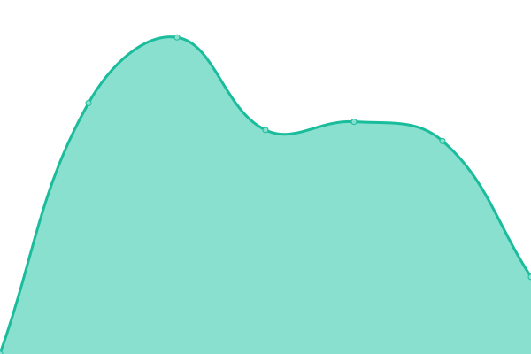 1004ms
     
 | 

<a href="https://divtiply.github.io/artupptime/history/sbi-art-auction">100.00%</a>
    

|  [Piasa](https://www.piasa.fr/en/home) | 🟥 Down | [piasa.yml](https://github.com/divtiply/artupptime/commits/HEAD/history/piasa.yml) | 

 435ms
     
 | 

<a href="https://divtiply.github.io/artupptime/history/piasa">0.00%</a>
    

|  [Ravenel](https://ravenel.com/en/) | 🟩 Up | [ravenel.yml](https://github.com/divtiply/artupptime/commits/HEAD/history/ravenel.yml) | 

 1219ms
     
 | 

<a href="https://divtiply.github.io/artupptime/history/ravenel">100.00%</a>
    

|  [im Kinsky](https://imkinsky.com/en) | 🟩 Up | [imkinsky.yml](https://github.com/divtiply/artupptime/commits/HEAD/history/imkinsky.yml) | 

 793ms
     
 | 

<a href="https://divtiply.github.io/artupptime/history/imkinsky">99.84%</a>
    

|  [Saffronart](https://www.saffronart.com/) | 🟩 Up | [saffronart.yml](https://github.com/divtiply/artupptime/commits/HEAD/history/saffronart.yml) | 

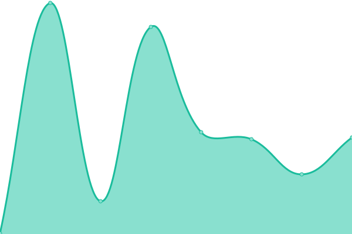 279ms
     
 | 

<a href="https://divtiply.github.io/artupptime/history/saffronart">100.00%</a>
    

|  [Koller](https://www.kollerauktionen.ch/en/home.htm) | 🟩 Up | [koller.yml](https://github.com/divtiply/artupptime/commits/HEAD/history/koller.yml) | 

 3768ms
     
 | 

<a href="https://divtiply.github.io/artupptime/history/koller">100.00%</a>
    

|  [iArt Auction](https://www.ise-art.co.jp/) | 🟩 Up | [iart.yml](https://github.com/divtiply/artupptime/commits/HEAD/history/iart.yml) | 

 1487ms
     
 | 

<a href="https://divtiply.github.io/artupptime/history/iart">100.00%</a>
    

|  [Deutscher and Hackett](https://www.deutscherandhackett.com/) | 🟩 Up | [deutscher-and-hackett.yml](https://github.com/divtiply/artupptime/commits/HEAD/history/deutscher-and-hackett.yml) | 

 943ms
     
 | 

<a href="https://divtiply.github.io/artupptime/history/deutscher-and-hackett">100.00%</a>
    

|  [AstaGuru](https://www.astaguru.com/) | 🟩 Up | [astaguru.yml](https://github.com/divtiply/artupptime/commits/HEAD/history/astaguru.yml) | 

 523ms
     
 | 

<a href="https://divtiply.github.io/artupptime/history/astaguru">100.00%</a>
    

|  [China Guardian](https://www.cguardian.com/en/) | 🟩 Up | [china-guardian.yml](https://github.com/divtiply/artupptime/commits/HEAD/history/china-guardian.yml) | 

 847ms
     
 | 

<a href="https://divtiply.github.io/artupptime/history/china-guardian">100.00%</a>
    

|  [Karl & Faber](https://www.karlundfaber.de/en/) | 🟩 Up | [karl-and-faber.yml](https://github.com/divtiply/artupptime/commits/HEAD/history/karl-and-faber.yml) | 

 876ms
     
 | 

<a href="https://divtiply.github.io/artupptime/history/karl-and-faber">100.00%</a>
    

|  [Polswiss Art](https://www.polswissart.pl/pl) | 🟩 Up | [polswissart.yml](https://github.com/divtiply/artupptime/commits/HEAD/history/polswissart.yml) | 

 940ms
     
 | 

<a href="https://divtiply.github.io/artupptime/history/polswissart">100.00%</a>
    

|  [Aguttes](https://www.aguttes.com/en/home) | 🟩 Up | [aguttes.yml](https://github.com/divtiply/artupptime/commits/HEAD/history/aguttes.yml) | 

 1011ms
     
 | 

<a href="https://divtiply.github.io/artupptime/history/aguttes">100.00%</a>
    

|  [Scottsdale Art Auction](https://scottsdaleartauction.com/) | 🟩 Up | [scottsdale-art-auction.yml](https://github.com/divtiply/artupptime/commits/HEAD/history/scottsdale-art-auction.yml) | 

 166ms
     
 | 

<a href="https://divtiply.github.io/artupptime/history/scottsdale-art-auction">100.00%</a>
    

|  [Van Ham](https://www.van-ham.com/en/index.html) | 🟩 Up | [van-ham.yml](https://github.com/divtiply/artupptime/commits/HEAD/history/van-ham.yml) | 

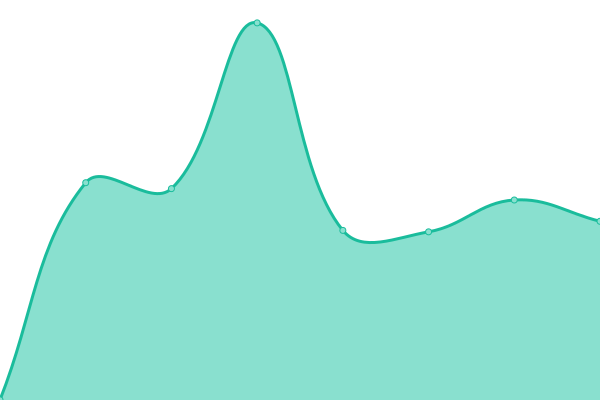 1327ms
     
 | 

<a href="https://divtiply.github.io/artupptime/history/van-ham">100.00%</a>
    

|  [Freeman's](https://www.freemansauction.com/) | 🟥 Down | [freemans.yml](https://github.com/divtiply/artupptime/commits/HEAD/history/freemans.yml) | 

 112ms
     
 | 

<a href="https://divtiply.github.io/artupptime/history/freemans">0.00%</a>
    

|  [Hindman](https://hindmanauctions.com/) | 🟩 Up | [hindman.yml](https://github.com/divtiply/artupptime/commits/HEAD/history/hindman.yml) | 

 505ms
     
 | 

<a href="https://divtiply.github.io/artupptime/history/hindman">100.00%</a>
    

|  [Casa d'aste Meeting Art](https://www.meetingart.it/) | 🟩 Up | [meetingart.yml](https://github.com/divtiply/artupptime/commits/HEAD/history/meetingart.yml) | 

 1136ms
     
 | 

<a href="https://divtiply.github.io/artupptime/history/meetingart">100.00%</a>
    

|  [Tajan](https://www.tajan.com/en/) | 🟥 Down | [tajan.yml](https://github.com/divtiply/artupptime/commits/HEAD/history/tajan.yml) | 

 216ms
     
 | 

<a href="https://divtiply.github.io/artupptime/history/tajan">0.00%</a>
    

|  [Poly Auction](https://www.polyauction.com.hk/en) | 🟩 Up | [poly-auction.yml](https://github.com/divtiply/artupptime/commits/HEAD/history/poly-auction.yml) | 

 1727ms
     
 | 

<a href="https://divtiply.github.io/artupptime/history/poly-auction">100.00%</a>
    

|  [Hampel](https://www.hampel-auctions.com/index.html?la=en) | 🟩 Up | [hampel.yml](https://github.com/divtiply/artupptime/commits/HEAD/history/hampel.yml) | 

 1005ms
     
 | 

<a href="https://divtiply.github.io/artupptime/history/hampel">100.00%</a>
    

|  [Menzies Art Brands](https://www.menziesartbrands.com/) | 🟩 Up | [menzies.yml](https://github.com/divtiply/artupptime/commits/HEAD/history/menzies.yml) | 

 982ms
     
 | 

<a href="https://divtiply.github.io/artupptime/history/menzies">100.00%</a>
    

|  [Millon](https://www.millon.com/en) | 🟩 Up | [millon.yml](https://github.com/divtiply/artupptime/commits/HEAD/history/millon.yml) | 

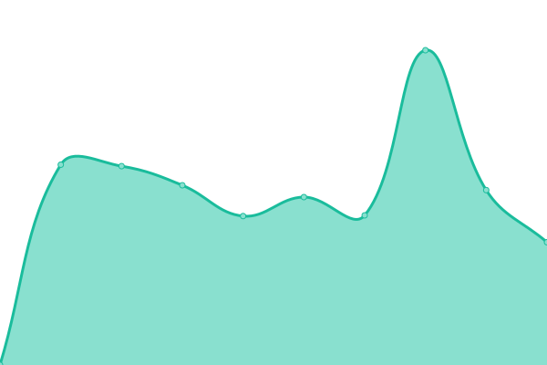 781ms
     
 | 

<a href="https://divtiply.github.io/artupptime/history/millon">100.00%</a>
    

|  [De Vuyst](https://de-vuyst.com/en) | 🟩 Up | [de-vuyst.yml](https://github.com/divtiply/artupptime/commits/HEAD/history/de-vuyst.yml) | 

 1707ms
     
 | 

<a href="https://divtiply.github.io/artupptime/history/de-vuyst">100.00%</a>
    

|  [Smith & Singer](https://www.smithandsinger.com.au/) | 🟩 Up | [smith-and-singer.yml](https://github.com/divtiply/artupptime/commits/HEAD/history/smith-and-singer.yml) | 

 934ms
     
 | 

<a href="https://divtiply.github.io/artupptime/history/smith-and-singer">100.00%</a>
    

|  [Ader](https://www.ader-paris.fr/en/home) | 🟩 Up | [ader.yml](https://github.com/divtiply/artupptime/commits/HEAD/history/ader.yml) | 

 919ms
     
 | 

<a href="https://divtiply.github.io/artupptime/history/ader">100.00%</a>
    

|  [Strauss & Co](https://www.straussart.co.za/) | 🟩 Up | [strauss-and-co.yml](https://github.com/divtiply/artupptime/commits/HEAD/history/strauss-and-co.yml) | 

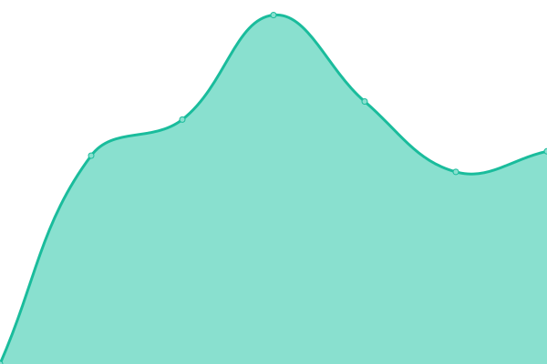 3899ms
     
 | 

<a href="https://divtiply.github.io/artupptime/history/strauss-and-co">100.00%</a>
    

|  [Uppsala Auktionskammare](https://www.uppsalaauktion.se/en/) | 🟩 Up | [uppsala.yml](https://github.com/divtiply/artupptime/commits/HEAD/history/uppsala.yml) | 

 843ms
     
 | 

<a href="https://divtiply.github.io/artupptime/history/uppsala">100.00%</a>
    

|  [Lehr Kunstauktionen](https://lehr-kunstauktionen.de/en/) | 🟩 Up | [lehr-kunstauktionen.yml](https://github.com/divtiply/artupptime/commits/HEAD/history/lehr-kunstauktionen.yml) | 

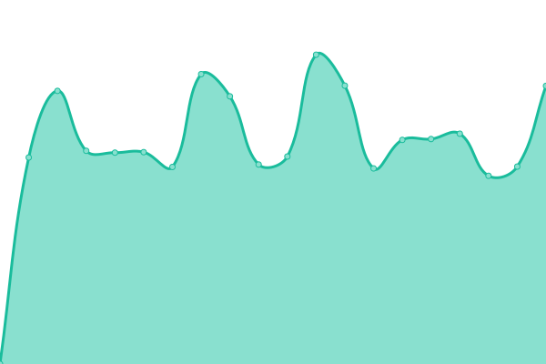 1985ms
     
 | 

<a href="https://divtiply.github.io/artupptime/history/lehr-kunstauktionen">97.48%</a>
    

|  [Casa d'aste Farsettiarte](https://www.farsettiarte.it/uk/index.asp) | 🟥 Down | [farsettiarte.yml](https://github.com/divtiply/artupptime/commits/HEAD/history/farsettiarte.yml) | 

 169ms
     
 | 

<a href="https://divtiply.github.io/artupptime/history/farsettiarte">0.00%</a>
    

|  [Forum Auctions](https://www.forumauctions.co.uk/) | 🟩 Up | [forum-auctions.yml](https://github.com/divtiply/artupptime/commits/HEAD/history/forum-auctions.yml) | 

 1816ms
     
 | 

<a href="https://divtiply.github.io/artupptime/history/forum-auctions">100.00%</a>
    

|  [K Auction](https://www.k-auction.com/) | 🟩 Up | [k-auction.yml](https://github.com/divtiply/artupptime/commits/HEAD/history/k-auction.yml) | 

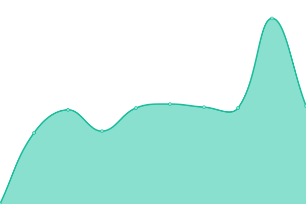 2054ms
     
 | 

<a href="https://divtiply.github.io/artupptime/history/k-auction">100.00%</a>
    

|  [Kornfeld](https://www.kornfeld.ch/) | 🟩 Up | [kornfeld.yml](https://github.com/divtiply/artupptime/commits/HEAD/history/kornfeld.yml) | 

 1545ms
     
 | 

<a href="https://divtiply.github.io/artupptime/history/kornfeld">100.00%</a>
    

|  [Lyon & Turnbull](https://www.lyonandturnbull.com/) | 🟩 Up | [lyon-and-turnbull.yml](https://github.com/divtiply/artupptime/commits/HEAD/history/lyon-and-turnbull.yml) | 

 393ms
     
 | 

<a href="https://divtiply.github.io/artupptime/history/lyon-and-turnbull">100.00%</a>
    

|  [Roseberys](https://www.roseberys.co.uk/) | 🟩 Up | [roseberys.yml](https://github.com/divtiply/artupptime/commits/HEAD/history/roseberys.yml) | 

 1259ms
     
 | 

<a href="https://divtiply.github.io/artupptime/history/roseberys">100.00%</a>
    

|  [Tate Ward](https://www.tateward.com/) | 🟩 Up | [tate-ward.yml](https://github.com/divtiply/artupptime/commits/HEAD/history/tate-ward.yml) | 

 776ms
     
 | 

<a href="https://divtiply.github.io/artupptime/history/tate-ward">100.00%</a>
    

|  [Stockholms Auktionsverk](https://www.auktionsverket.com/en/) | 🟩 Up | [stockholms-auktionsverk.yml](https://github.com/divtiply/artupptime/commits/HEAD/history/stockholms-auktionsverk.yml) | 

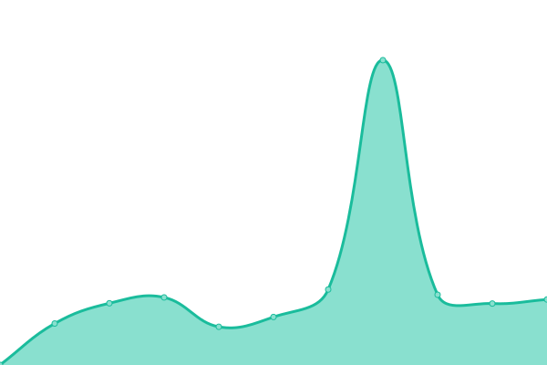 779ms
     
 | 

<a href="https://divtiply.github.io/artupptime/history/stockholms-auktionsverk">100.00%</a>
    

|  [Yongle Auction](https://www.yongleauction.com/en/) | 🟩 Up | [yongle.yml](https://github.com/divtiply/artupptime/commits/HEAD/history/yongle.yml) | 

 1660ms
     
 | 

<a href="https://divtiply.github.io/artupptime/history/yongle">100.00%</a>
    

|  [Sungari International Auction](https://www.sungari1995.com/) | 🟩 Up | [sungari.yml](https://github.com/divtiply/artupptime/commits/HEAD/history/sungari.yml) | 

 1356ms
     
 | 

<a href="https://divtiply.github.io/artupptime/history/sungari">100.00%</a>
    

|  [Artsy](https://www.artsy.net/) | 🟩 Up | [artsy.yml](https://github.com/divtiply/artupptime/commits/HEAD/history/artsy.yml) | 

 447ms
     
 | 

<a href="https://divtiply.github.io/artupptime/history/artsy">100.00%</a>
    

|  [Invaluable](https://www.invaluable.com/) | 🟥 Down | [invaluable.yml](https://github.com/divtiply/artupptime/commits/HEAD/history/invaluable.yml) | 

 114ms
     
 | 

<a href="https://divtiply.github.io/artupptime/history/invaluable">0.00%</a>
    

|  [Drouot](https://drouot.com/en) | 🟩 Up | [drouot.yml](https://github.com/divtiply/artupptime/commits/HEAD/history/drouot.yml) | 

 701ms
     
 | 

<a href="https://divtiply.github.io/artupptime/history/drouot">100.00%</a>
    

|  [Artnet](https://www.artnet.com/) | 🟩 Up | [artnet.yml](https://github.com/divtiply/artupptime/commits/HEAD/history/artnet.yml) | 

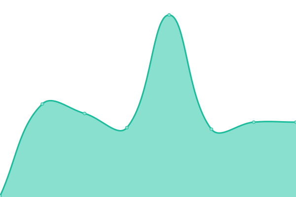 115ms
     
 | 

<a href="https://divtiply.github.io/artupptime/history/artnet">100.00%</a>
    

|  [MutualArt](https://www.mutualart.com/) | 🟩 Up | [mutualart.yml](https://github.com/divtiply/artupptime/commits/HEAD/history/mutualart.yml) | 

 685ms
     
 | 

<a href="https://divtiply.github.io/artupptime/history/mutualart">100.00%</a>
    

|  [LiveAuctioneers](https://www.liveauctioneers.com/) | 🟩 Up | [liveauctioneers.yml](https://github.com/divtiply/artupptime/commits/HEAD/history/liveauctioneers.yml) | 

 343ms
     
 | 

<a href="https://divtiply.github.io/artupptime/history/liveauctioneers">99.82%</a>
    

|  [Barnebys](https://www.barnebys.com/) | 🟩 Up | [barnebys.yml](https://github.com/divtiply/artupptime/commits/HEAD/history/barnebys.yml) | 

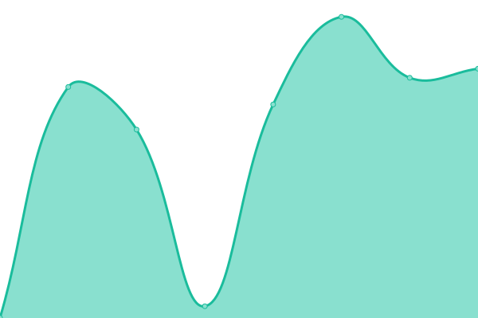 917ms
     
 | 

<a href="https://divtiply.github.io/artupptime/history/barnebys">100.00%</a>
    

|  [BidtoArt](https://bidtoart.com/) | 🟩 Up | [bidtoart.yml](https://github.com/divtiply/artupptime/commits/HEAD/history/bidtoart.yml) | 

 480ms
     
 | 

<a href="https://divtiply.github.io/artupptime/history/bidtoart">100.00%</a>
    

|  [askART](https://www.askart.com/) | 🟩 Up | [askart.yml](https://github.com/divtiply/artupptime/commits/HEAD/history/askart.yml) | 

 466ms
     
 | 

<a href="https://divtiply.github.io/artupptime/history/askart">99.84%</a>
    

|  [ArtChart](https://artchart.net/en) | 🟩 Up | [artchart.yml](https://github.com/divtiply/artupptime/commits/HEAD/history/artchart.yml) | 

 1582ms
     
 | 

<a href="https://divtiply.github.io/artupptime/history/artchart">99.85%</a>
    

|  [ArtPro](https://artpro.com/?locale=en) | 🟩 Up | [artpro.yml](https://github.com/divtiply/artupptime/commits/HEAD/history/artpro.yml) | 

 2318ms
     
 | 

<a href="https://divtiply.github.io/artupptime/history/artpro">100.00%</a>
    

|  [Darz](https://darz.art/en) | 🟩 Up | [darz.yml](https://github.com/divtiply/artupptime/commits/HEAD/history/darz.yml) | 

 751ms
     
 | 

<a href="https://divtiply.github.io/artupptime/history/darz">100.00%</a>
    

|  [Arcadja](https://www.arcadja.com/auctions/en/) | 🟩 Up | [arcadja.yml](https://github.com/divtiply/artupptime/commits/HEAD/history/arcadja.yml) | 

 2480ms
     
 | 

<a href="https://divtiply.github.io/artupptime/history/arcadja">99.82%</a>
    

|  [Collector Daily](https://collectordaily.com/) | 🟩 Up | [collector-daily.yml](https://github.com/divtiply/artupptime/commits/HEAD/history/collector-daily.yml) | 

 263ms
     
 | 

<a href="https://divtiply.github.io/artupptime/history/collector-daily">100.00%</a>
    

|  [Art.co](https://art.co/) | 🟩 Up | [art-co.yml](https://github.com/divtiply/artupptime/commits/HEAD/history/art-co.yml) | 

 109ms
     
 | 

<a href="https://divtiply.github.io/artupptime/history/art-co">100.00%</a>
    

|  [Art Basel](https://www.artbasel.com/) | 🟩 Up | [art-basel.yml](https://github.com/divtiply/artupptime/commits/HEAD/history/art-basel.yml) | 

 1268ms
     
 | 

<a href="https://divtiply.github.io/artupptime/history/art-basel">100.00%</a>
    

|  [Frieze](https://www.frieze.com/) | 🟩 Up | [frieze.yml](https://github.com/divtiply/artupptime/commits/HEAD/history/frieze.yml) | 

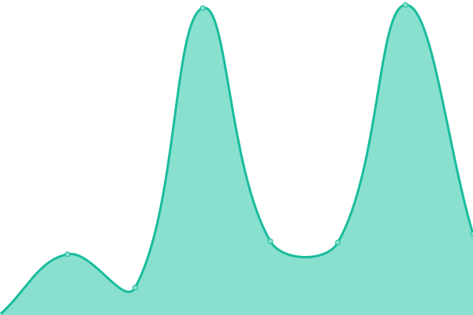 490ms
     
 | 

<a href="https://divtiply.github.io/artupptime/history/frieze">100.00%</a>
    

|  [Archeus](https://www.archeus.com/) | 🟩 Up | [archeus.yml](https://github.com/divtiply/artupptime/commits/HEAD/history/archeus.yml) | 

 412ms
     
 | 

<a href="https://divtiply.github.io/artupptime/history/archeus">100.00%</a>
    

|  [Artfacts](https://artfacts.net/) | 🟩 Up | [artfacts.yml](https://github.com/divtiply/artupptime/commits/HEAD/history/artfacts.yml) | 

 475ms
     
 | 

<a href="https://divtiply.github.io/artupptime/history/artfacts">100.00%</a>
    

<!--end: status pages-->

[**Visit our status website →**](https://divtiply.github.io/artupptime)

## 📄 License

- Powered by: [Upptime](https://github.com/upptime/upptime)
- Code: [MIT](./LICENSE) © [Anand Chowdhary](https://anandchowdhary.com), supported by [Pabio](https://pabio.com)
- Data in the `./history` directory: [Open Database License](https://opendatacommons.org/licenses/odbl/1-0/)
