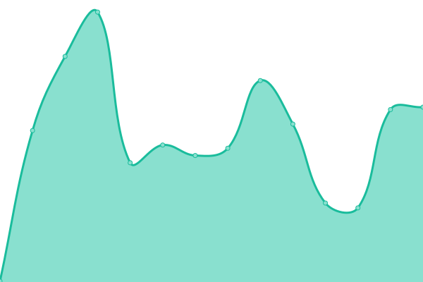

# [📈 Live Status](https://divtiply.github.io/artupptime): <!--live status--> **🟧 Partial outage**

This repository contains the open-source uptime monitor and status page for [Michel Ace](https://divtiply.github.io/artupptime), powered by [Upptime](https://github.com/upptime/upptime).

With [Upptime](https://upptime.js.org), you can get your own unlimited and free uptime monitor and status page, powered entirely by a GitHub repository. We use [Issues](https://github.com/divtiply/artupptime/issues) as incident reports, [Actions](https://github.com/divtiply/artupptime/actions) as uptime monitors, and [Pages](https://divtiply.github.io/artupptime) for the status page.

<!--start: status pages-->
<!-- This summary is generated by Upptime (https://github.com/upptime/upptime) -->
<!-- Do not edit this manually, your changes will be overwritten -->
<!-- prettier-ignore -->
| URL | Status | History | Response Time | Uptime |
| --- | ------ | ------- | ------------- | ------ |
|  [Christie's](https://www.christies.com/) | 🟥 Down | [christie-s.yml](https://github.com/divtiply/artupptime/commits/HEAD/history/christie-s.yml) | 

 269ms
     
 | 

<a href="https://divtiply.github.io/artupptime/history/christie-s">73.22%</a>
    

|  [Sotheby's](https://www.sothebys.com/en/) | 🟩 Up | [sotheby-s.yml](https://github.com/divtiply/artupptime/commits/HEAD/history/sotheby-s.yml) | 

 90ms
     
 | 

<a href="https://divtiply.github.io/artupptime/history/sotheby-s">100.00%</a>
    

|  [Phillips](https://www.phillips.com/) | 🟥 Down | [phillips.yml](https://github.com/divtiply/artupptime/commits/HEAD/history/phillips.yml) | 

 1179ms
     
 | 

<a href="https://divtiply.github.io/artupptime/history/phillips">99.68%</a>
    

|  [Bonhams](https://www.bonhams.com/) | 🟥 Down | [bonhams.yml](https://github.com/divtiply/artupptime/commits/HEAD/history/bonhams.yml) | 

 124ms
     
 | 

<a href="https://divtiply.github.io/artupptime/history/bonhams">0.02%</a>
    

|  [China Guardian](https://www.cguardian.com/en/) | 🟩 Up | [china-guardian.yml](https://github.com/divtiply/artupptime/commits/HEAD/history/china-guardian.yml) | 

 1621ms
     
 | 

<a href="https://divtiply.github.io/artupptime/history/china-guardian">100.00%</a>
    

|  [Poly Auction](https://www.polyauction.com.hk/en) | 🟩 Up | [poly-auction.yml](https://github.com/divtiply/artupptime/commits/HEAD/history/poly-auction.yml) | 

 1690ms
     
 | 

<a href="https://divtiply.github.io/artupptime/history/poly-auction">100.00%</a>
    

|  [Art Basel](https://www.artbasel.com/) | 🟩 Up | [art-basel.yml](https://github.com/divtiply/artupptime/commits/HEAD/history/art-basel.yml) | 

 1141ms
     
 | 

<a href="https://divtiply.github.io/artupptime/history/art-basel">100.00%</a>
    

<!--end: status pages-->

[**Visit our status website →**](https://divtiply.github.io/artupptime)

## 📄 License

- Powered by: [Upptime](https://github.com/upptime/upptime)
- Code: [MIT](./LICENSE) © [Anand Chowdhary](https://anandchowdhary.com), supported by [Pabio](https://pabio.com)
- Data in the `./history` directory: [Open Database License](https://opendatacommons.org/licenses/odbl/1-0/)
